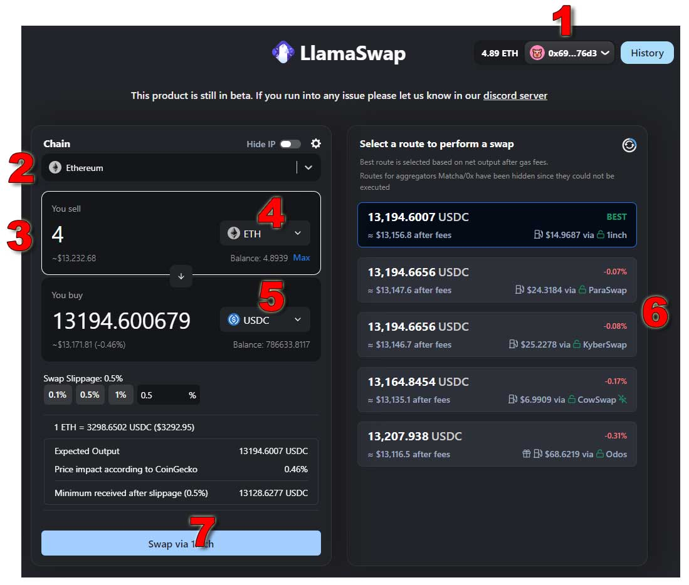

HOW TO TRADE ON DEX AGGREGATORS TIPS.

### What is DEX Aggregator(s)?
DEX Aggregators are tools to help you to search for the best price options. Some DEX Aggregators such as [DeFiLlama](https://swap.defillama.com/) is very good. They provide in real time price search and have the lowest price spread. DeFiLlama's aggregator or aggregators also provide your transaction against MEV, Front Running, and lowest slippage.

This instructions is mainly for DeFiLlama. If you are interested, the go to the next steps.

### DeFILlama
Goto DeFiLlama [https://swap.defillama.com/](https://swap.defillama.com/)

1. Connect your wallet
2. Make sure to select "Ethereum" as your mainnet transaction
3. Enter the amount you want to swap
4. Select the asset type you want to swap from
5. Select the asset type you want to swap to
6. Select aggregator.
  The list will constantly update on the best slippage, so pick the best option e.g. gas fees, protection types. Using Cowswap has the option to protect you from MEV.
7. Once you are ready, click to start the swap.

Note: You will have to do two (2) contract interaction with Metamask. The first Metamask transaction will ask you to authorize the amount you want to swap. And the second Metamask transaction will do the final swap.

Note: Make sure you double check everything before and after.